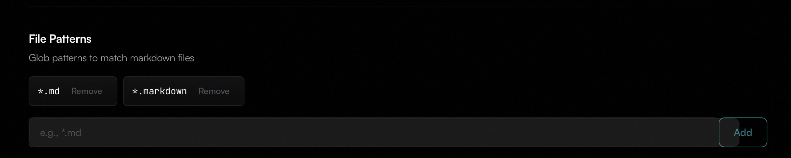

# Bug Report

The following bugs have been identified in the application:

1. **Resolved** ~~Unable to save changes to source file when using the Milkdown editor. This is for manual save and auto save. Error below:~~
2. **Resolved** ~~Unable to add single file to tracking without refresh~~
3. **Resolved** ~~A single click to open the milkdown editor when interacting with the document tree feels odd. Let's change it to double click. Also, the enter key should open the milkdown editor.~~
4. **Resolved** ~~The "warning" accent color's title and references should be changed to intermediary.~~
5. **Resolved** ~~The default secondary color value should be changed to #6B00E5 and the default intermediary color should be changed to #D10467.~~
6. **Resolved** ~~If you hit the same key twice within the milkdown editor, the focus shifts away from the editor. For example, pressing `d`, `d` in succession shifts focus.~~
7. **Resolved** ~~`Message` componenet CSS is not tied directly to the user defined theme. Font color needs to always be readable similar to other components.~~
8. **Resolved** ~~The input field for file patterns extends into the "Add" button element. This needs to be fixed. See the attached image. ~~
9. **Resolved** ~~The state of items is not being updated in the document tree after saving changes to the source file. You have to refresh the document tree to see the changes. We need to ensure item state is correctly updated across both the document tree and editor after changed are made.~~
10. **Resolved** ~~An item selected in the document tree is deselected when the user opens the milkdown editor and then closes it.~~
11. **Resolved** ~~When first opening the Editor modal and clicking into the edit field. The first key press shifts focus out of the edit field. This does not happen again if the auto save feature is turned off. If the auto save feature is turned on, this happens for the first few key presses.~~
12. **Resolved** ~~Item state is not changing in the document tree when hitting space. This should be the only keyboard shortcut or mouse interaction that transitions an item's state manually. Parent Child transition states should remain as is.~~
13. **Resolved** ~~FileCards on the primary dashboard do not show the total number of items left to work through.~~